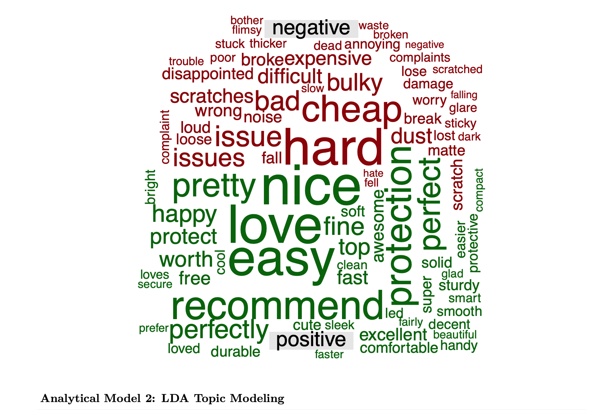

# Uncovering Consumer Insights via Text Mining: Sentiment Analysis & LDA Topic Modeling

👉 **Click here to view the full Interactive HTML Report:** [Text_mining.html]

## 1. Research Question
What are the underlying themes and emotional polarities driving customer satisfaction or dissatisfaction in e-commerce product reviews, and how can these unstructured insights be leveraged for product strategy?

## 2. Methodology
To extract insights from unstructured textual data, this study employs **Natural Language Processing (NLP)** techniques. First, a Lexicon-based **Sentiment Analysis** is applied to quantify the emotional polarity of consumer reviews. Second, **Latent Dirichlet Allocation (LDA)**, an unsupervised generative probabilistic model, is utilized for **Topic Modeling** to discover hidden semantic structures within the text.

Prior to modeling, rigorous data preprocessing is conducted, including tokenization, stop-word removal, and scaling, to ensure the validity of the text corpus.

> **Data Note:** The quantitative analysis is based on the `Cell_Phones_and_Accessories_5 2.json` dataset, which contains 194,439 unstructured e-commerce reviews. Due to memory constraints and GitHub's file size limitations for large datasets, a random sample of 10,000 reviews was utilized to ensure computational efficiency and statistical representation. The raw dataset is not hosted in this repository; however, the exact data structure and analytical models can be thoroughly inspected in the provided R Markdown (.Rmd) and HTML reports.

## 3. Visualizing Unstructured Data
*(Bạn hãy upload 2 bức ảnh WordCloud và Biểu đồ Topic 1, 2, 3 lên GitHub, copy link ảnh và dán đè lên 2 dòng dưới đây nhé)*

**Sentiment Comparison Cloud:**

**Top 10 Words Defining Each Hidden Topic (LDA):**

## 4. Findings & Implications

**1. Findings (Textual & Behavioral Insights):**
The integration of Lexicon-based Sentiment Analysis and LDA Topic Modeling reveals critical insights into post-purchase behavior:
- **The Sentiment Asymmetry:** The WordCloud demonstrates a stark contrast in sentiment drivers. Positive emotions are heavily associated with aesthetics and initial usability (e.g., "nice", "love", "easy", "perfectly"). Conversely, negative sentiments are strictly tied to material durability and functional failure (e.g., "cheap", "broke", "disappointed", "flimsy", "waste").
- **Latent Themes in Consumer Discourse:** The LDA algorithm successfully deconstructed the text corpus into three actionable business topics:
  - *Topic 1 (Protective Accessories & Fitment):* Dominated by terms like "screen", "protector", "cover", and "fit". This highlights that for phone accessories, the precision of physical dimensions is a primary driver of reviews.
  - *Topic 2 (Battery Longevity & Android Devices):* Characterized by "battery", "galaxy", "time", "day", and "samsung". This indicates a persistent conversation regarding battery degradation among Android users.
  - *Topic 3 (Charging Infrastructure):* Defined by "charge", "charger", "usb", "cable", and "power". This points to a high failure rate or compatibility friction surrounding charging peripherals.

**2. Implications (Strategic & Academic Contributions):**
- **Business Strategy (R&D and QA Reallocation):** The analysis reveals that the root cause of 1-star reviews is rarely the core smartphone itself, but rather the peripheral ecosystem (flimsy cables, poorly fitted covers). Management should pivot R&D budgets away from minor aesthetic enhancements and heavily invest in Quality Assurance (QA) for material durability to address "cheap" and "broke" complaints. 
- **Academic Contribution:** This quantitative study empirically proves that post-purchase satisfaction is not a monolithic construct but is highly segmented into micro-experiences (e.g., charging speed, accessory fitment). By integrating LDA with sentiment scoring, this methodology provides a scalable blueprint for extracting actionable product telemetry from unstructured User-Generated Content (UGC).
